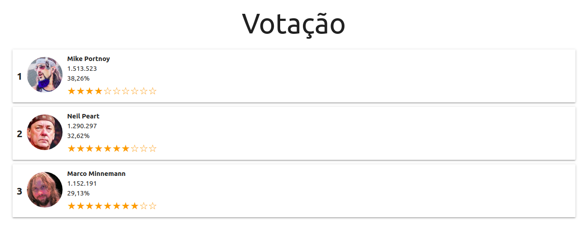

# Votação
#### Desafio guiado 03

## Requisitos
É necessário subir o backend antes do frontend:

    $ cd backend && yarn
    $ yarn start

Abra outra aba do terminal e execute:
    
    $ cd ..
    $ cd frontend && yarn
    $ yarn start

